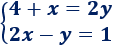
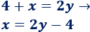
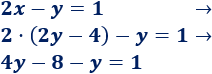
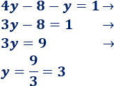
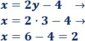

# RESOLVER UN SISTEMA MEDIANTE SUSTITUCIÓN 


En esta página aprenderás a resolver un sistema de ecuaciones  
mediante el método de sustitución.

Debes recordar que hay tres métodos para resolver un sistema de  
ecuaciones lineales:

* Método de sustitución
* Método de igualación
* Método de reducción  

## Definición del método de sustitución

El **método de sustitución** consiste en despejar una de las dos *incógnitas* para  
**sustituirla** en la otra ecuación.

### Estos son los pasos a seguir:  

1. **Despejo** cualquiera de las dos *variables* en una de las dos ecuaciones.  
(Recomiendo realizarlo con la incógnita más sencilla de despejar)  

2. **Sustituyo** en la otra ecuación el valor despejado anteriormente en la  
*ecuación del paso 1*.  

3. Ahora tendremos una ecuación en función de una variable x o y, por lo  
que **simplifico** y **despejo** para obtener el valor de esa variable.  

4. Una vez calculado el valor de una de las variables, **sustituyo** el valor en  
cualquiera de las dos ecuaciones de mi sistema para encontrar el valor de  
la variable que me falta por calcular.  


### Ejemplo resuelto mediante código python
```python
#-- Ejemplo de sistema en python
4 + x = 2y
2x - y = 1

print("estamos calculando el valor de x e y")

```

En python el sistema anterior produce como resultado `x = 2` e `y = 3`  

### Ejemplo resuelto paso a paso  

  

1. **Despejo** la incógnita x: 

      

2. **Sustituyo** la incógnita x en la otra ecuación:  

     

3. **Resuelvo** la ecuación obtenida:  

     

4. **Calculo** la otra incógnita sustituyendo:  

      

5. La **solución** del sistema es:  **x = 2** e **y = 3**


### Enlaces útiles 

En esta página puedes encontrar más teoría y ejercicios sobre 
[sistemas de ecuaciones](https://www.matesfacil.com/ESO/Ecuaciones/resueltos-sistemas-ecuaciones.html)